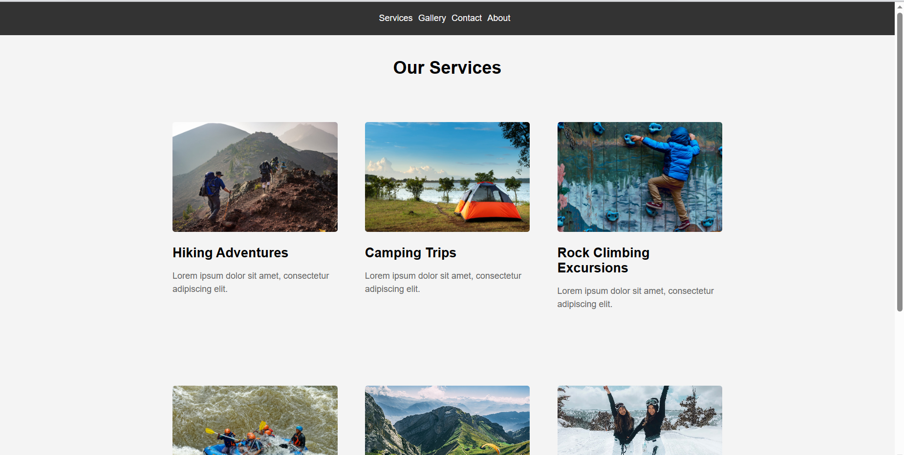
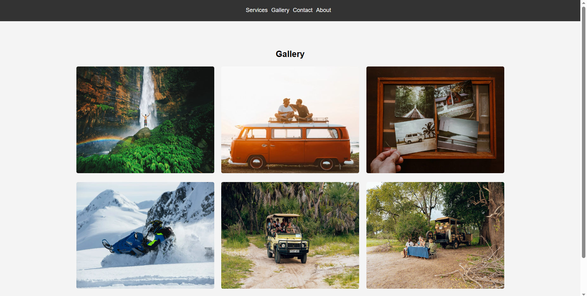
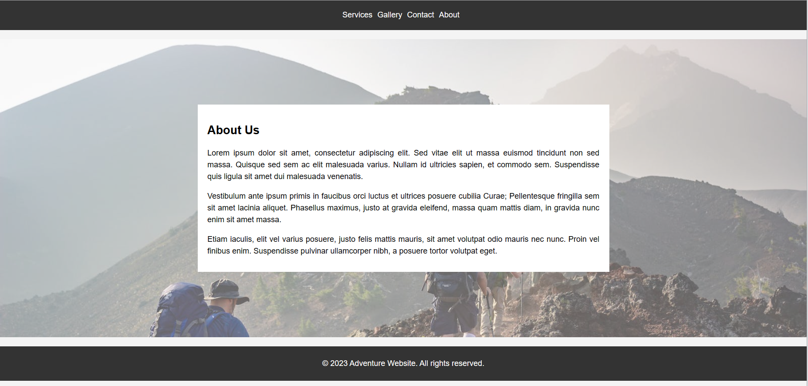

# Adventure-Website
Multipage website using HTML and CSS

<<<<<<< Updated upstream
This is an adventure website built using static HTML and CSS. It showcases various adventure destinations and activities for thrill-seekers and outdoor enthusiasts. The website is designed to provide an immersive experience and inspire visitors to embark on thrilling adventures.

## Features

- Responsive design: The website is fully responsive and adapts to different screen sizes, including mobile devices, tablets, and desktops.
- Interactive navigation: Users can easily navigate through the website using the interactive navigation menu.

## Installation

1. Clone the repository to your local machine using the following command:

  git clone https://github.com/laibabintatahir/Adventure-Website.git

2. Open the `home.html` file in your preferred web browser.

## Usage

- Explore the adventure destinations: Click on the destination links in the navigation menu or scroll down to view the available adventure destinations. Click on a destination to view more details and photos.
- Contact: Fill out the contact form to send a message to the website administrators.

## Contributing

Contributions to this project are welcome. If you have any suggestions, enhancements, or bug fixes, please follow these steps:

1. Fork the repository.
2. Create a new branch for your contribution.
3. Make your changes and test them thoroughly.
4. Submit a pull request detailing your changes.
=======

>>>>>>> Stashed changes
